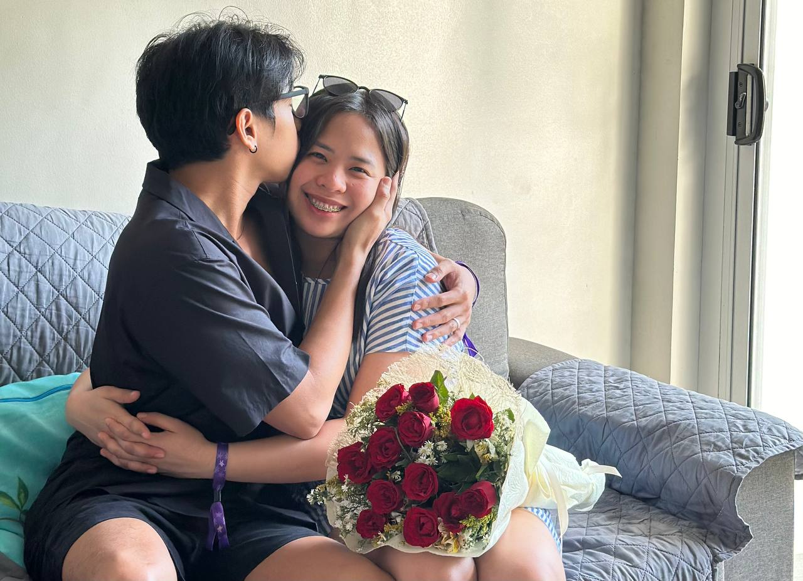

<!DOCTYPE html>
<html lang="en">
<head>
<meta charset="UTF-8">
<meta name="viewport" content="width=device-width, initial-scale=1.0">
<title>Balentayms</title>

</head>

<body>

    <!-- CHANGE IMAGE HERE -->
    

    <h1>Date tayo? o Magdadate tayo?💖</h1>

    

        Choose wisely
    

    
Forced YES in: 12

    

        <button id="no">NO 😈</button>
        <button id="yes">YES 💘</button>
    

    

        💞 Yey!!! Okay! 💞 
        Wala ka din naman choice 🥰
    

<audio id="panic" src="https://www.myinstants.com/media/sounds/windows-error.mp3"></audio>
<audio id="win" src="https://www.myinstants.com/media/sounds/anime-wow-sound-effect.mp3"></audio>

</body>
</html>
